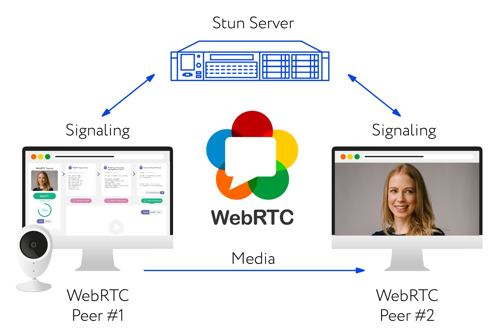
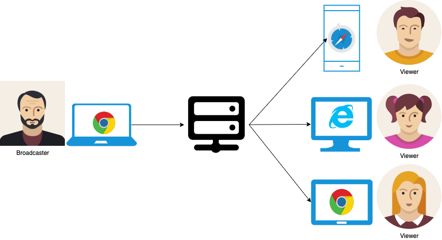

# Live Video Chat


Uma aplicação minimalista para realizar os testes de um live chat usando como tecnologias.

- Php
- Javascript
- Html5
- Css3
- WebSockets
- Mysql
  
E como ferramenta de trabalho ou biblioteca estarei usando o `WebRTC` (Web Real-Time-Communication).

E uma ferramente designada para comunicação de pessoa a pessoa.

**WebRTC** é uma API em desenvolvimento elaborada pela World Wide Web Consortium para permitir aos navegadores executar aplicações de chamada telefônica, video chat e compartilhamento P2P sem a necessidade de plugins. 

Com essa lib podemos construir diversos tipos de aplicação.

- Video Chat
- Voices (Chamadas online)
- Notificações

Entre outras aplicações utilizando apenas o browser.


Basicamente para interação via video funciona da seguinte forma.



E isso facilita em muitos aspectos.

E também me possibilita realizar a comunicação com diferentes clients (Browsers).

**peer-to-peer**

exemplo:




Exemplos de aplicações que utilizam o WebRTC

- Cloud Gaming
- Google Meet
- Facebook Messager
- Discord

Entre outras.


## Para startar o projecto

Primeiro inicie o servidor

```bash
php bin/server.php
```

A conexão estará activa


## Links

[Socket IO](http://socketo.me/docs/hello-world)